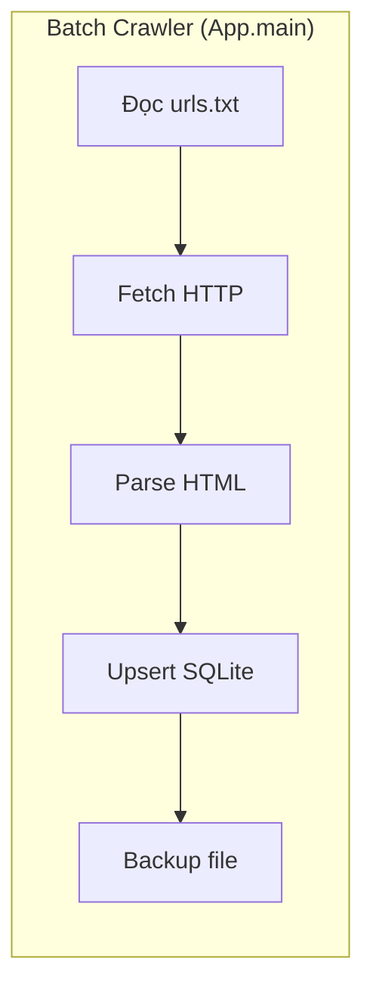
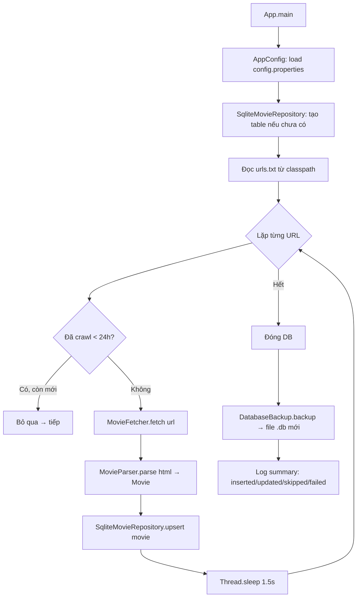

# Movie CMS — Codebase Discovery Document

> Mục đích: giúp bạn hiểu project này đang làm gì, chạy thế nào, code nằm ở đâu — dựa **chính xác** trên codebase hiện tại, không suy diễn, không bịa.

---

# 1. Project Overview

## Vấn đề cần giải quyết

Đây là bài tập internship. Assignment gồm 5 bài, **hiện tại mới làm xong Bài 2 (Web Crawler & SQLite)**.

Bài 2 yêu cầu:
- Đọc ~100 URL phim từ file text
- Crawl nội dung HTML từng URL từ [toivote.com](https://toivote.com/)
- Bóc tách: tiêu đề, năm, quốc gia, thể loại, đạo diễn, diễn viên
- Lưu vào SQLite, backup ra disk
- Build thành fat JAR, chạy trên Docker VM

## Ai dùng?

- **Hiện tại:** không ai — đây là batch job (chạy xong là thoát)
- **Tương lai (bài 3-6):** API consumer, người vận hành Docker

## Kiến trúc tổng thể

**Layered monolith** — code được chia thành package theo tầng:

```
App.java  →  config → crawler → model → repository → backup
```

Mỗi package có một trách nhiệm duy nhất. Giao tiếp qua interface (`MovieRepository`) để sau này dễ swap implementation.



---

# 2. Technology Stack

Chỉ liệt kê những gì **có code dùng thật** (pom.xml có dependency nhưng chưa gọi = không tính):

| Công nghệ | Version | Dùng để làm gì |
|---|---|---|
| **Java 17** | 17 | Ngôn ngữ chính |
| **Maven** | 3.9+ | Build, chạy test, đóng gói fat JAR |
| **SQLite JDBC (xerial)** | 3.46.1 | Kết nối SQLite — DB embedded, không cần server |
| **Jsoup** | 1.18.1 | Parse HTML — biến HTML DOM thành object Java |
| **Gson** | 2.11.0 | JSON — serialize list fields (genres, directors, actors) thành JSON text để lưu SQLite |
| **Logback** | 1.5.6 | Ghi log ra file |
| **SLF4J** | 2.0.13 | API logging — Logback implement nó |
| **JUnit 5** | 5.11.0 | Test |
| **WireMock** | 3.9.2 | Mock HTTP server — test MovieFetcher không cần gọi thật toivote.com |

**Dependencies trong pom.xml nhưng chưa có code dùng:**
- `spark-core` 2.9.4 — dành cho bài 3 (web service)
- `guava` 33.3.0 — dành cho bài 5 (cache)

---

# 3. Repository Map

```
F:\App\hoc\workspace\VCCORP\projects\movie-cms-api/
│
├── pom.xml                              # Build file Maven
├── README.md                            # Mô tả project (đã viết trước 5 bài)
│
├── src/main/java/com/internship/moviecrawler/
│   ├── App.java                         # Điểm vào — chạy toàn bộ pipeline crawl
│   │
│   ├── config/
│   │   └── AppConfig.java               # Đọc config.properties → getter kiểu typed
│   │
│   ├── crawler/                         # Tầng "lấy dữ liệu"
│   │   ├── FetchException.java          # Lỗi HTTP: vĩnh viễn (404) vs tạm thời (5xx)
│   │   ├── ParseException.java          # Lỗi parse HTML
│   │   ├── MovieFetcher.java            # HTTP client + retry (Java HttpClient)
│   │   ├── MovieParser.java             # HTML → Movie (JSON-LD → fallback CSS)
│   │   └── UrlCollector.java            # Tự dò tìm URL phim từ toivote.com
│   │
│   ├── model/
│   │   └── Movie.java                   # Entity: id, url, title, year, country, genres, directors, actors, timestamps
│   │
│   ├── repository/
│   │   ├── MovieRepository.java         # Interface: upsert, findAll, findById, findByUrl, existsByUrl
│   │   └── SqliteMovieRepository.java   # SQLite: schema, upsert ON CONFLICT, JSON column
│   │
│   └── backup/
│       └── DatabaseBackup.java          # Copy .db → backup/movies_YYYYMMDD_HHmmss.db
│
├── src/main/resources/
│   ├── config.properties                # Cấu hình: timeout, retry, delay, đường dẫn
│   ├── logback.xml                      # Cấu hình log
│   └── urls.txt                         # 101 URL phim (mỗi dòng 1 URL)
│
├── src/test/                            # Test
│   ├── java/.../
│   │   ├── crawler/MovieFetcherTest.java    # 5 test (WireMock)
│   │   ├── crawler/MovieParserTest.java     # 9 test
│   │   └── repository/SqliteMovieRepositoryTest.java  # 8 test
│   └── resources/html/
│       ├── enchanted.html                   # HTML fake như toivote.com (có JSON-LD)
│       ├── minimal.html                     # HTML tối thiểu (chỉ title + year)
│       └── malformed.html                   # HTML không có title
│
├── scripts/
│   └── run.sh                           # Loop shell: chạy JAR mỗi 5s
│
├── docker/
│   └── Dockerfile                       # Ubuntu 22.04 + OpenSSH + Java 17
│
├── docs/
│   ├── assignment.md                    # Đề bài
│   ├── codebase-discovery.md            # ← bạn đang đọc
│   ├── plans/
│   │   └── 2026-07-24-exercise-02-plan.md
│   └── specs/
│       └── 2026-07-24-exercise-02-design.md
│
├── data/         # Runtime: SQLite DB (gitignored)
├── backup/       # Runtime: backup .db (gitignored)
└── logs/         # Runtime: log file (gitignored)
```

**Không có** (dù assignment có yêu cầu, trong code chưa có):
- `cache/` — bài 4
- `web/` — bài 3
- `auth/` — bài 6
- `ratelimit/` — bài 6

---

# 4. Startup Flow

## Crawl (Bài 2) — `App.main()`



## Web Service (Bài 3+) — chưa có

Trong assignment có yêu cầu web service, nhưng **chưa implement**. File `pom.xml` đã thêm `spark-core` để dành.

---

# 5. Runtime Architecture

## Hiện tại (chỉ Bài 2)

```
┌──────────────────────────────────────────────┐
│  App.main() — Batch Crawler                   │
│                                               │
│  ┌──────────────┐   ┌──────────────────┐      │
│  │ MovieFetcher │   │  MovieParser     │      │
│  │ (HttpClient) │──▶│  (Jsoup + Gson)  │      │
│  └──────────────┘   └────────┬─────────┘      │
│                              │ Movie object    │
│                              ▼                  │
│  ┌──────────────────────────────────────┐      │
│  │      SqliteMovieRepository           │      │
│  │      (SQLite upsert + JSON cols)     │      │
│  └────────────────┬─────────────────────┘      │
│                   │                            │
│                   ▼                            │
│  ┌──────────────────────────────┐             │
│  │  data/movies.db (SQLite)     │             │
│  └──────────────────────────────┘             │
│                                               │
│  Sau khi đóng DB: DatabaseBackup              │
│  → backup/movies_YYYYMMDD_HHmmss.db           │
└──────────────────────────────────────────────┘
```

Giải thích:
- **App.main()** là người điều phối — gọi các thành phần theo thứ tự
- **MovieFetcher** chỉ biết gửi HTTP request, không biết gì về Movie
- **MovieParser** chỉ biết parse HTML → Movie, không biết gì về HTTP hay DB
- **SqliteMovieRepository** chỉ biết đọc/ghi SQLite
- **DatabaseBackup** chỉ biết copy file

---

# 6. Data Flow

## Crawl một URL phim

```
URL từ urls.txt
      │
      ▼
Kiểm tra: đã crawl trong 24h qua chưa?
  ├── Có → skip (không gọi HTTP)
  └── Không → tiếp
                │
                ▼
MovieFetcher.fetch(url)
  ├── Thành công HTTP 200 + Content-Type: text/html
  │     → trả về HTML string
  ├── 404/400/403 → PermanentFetchException (bỏ qua, không retry)
  ├── 5xx/408/429/timeout → retry (1s, 2s, 4s) → TransientFetchException nếu hết lượt
  └── Interrupted → FetchException (thoát luôn vòng lặp)
                │
                ▼
MovieParser.parse(html, url)
  ├── Bước 1: Tìm <script type="application/ld+json"> có @type=Movie
  │     → Có: lấy name, dateCreated, genre, director, actor từ JSON
  │     → Không: chuyển sang Bước 2
  ├── Bước 2 (fallback): Dùng CSS selector
  │     → title: <title> hoặc <h1>
  │     → year: p.mt-1 (regex tìm số 19xx/20xx)
  │     → genres: div[aria-label=Thể loại] a
  │     → directors: p:containsOwn(Đạo diễn) → a
  │     → actors: p:containsOwn(Diễn viên) → a
  └── Không tìm được title → ParseException (bỏ qua URL này)

  Luật: title là bắt buộc, các field khác thiếu thì để default
  (year=null, country="", genres/directors/actors=[])
                │
                ▼
SqliteMovieRepository.upsert(movie)
  ├── INSERT INTO movies (...) VALUES (...) ON CONFLICT(url) DO UPDATE SET ...
  ├── List field (genres, directors, actors) → Gson → JSON string → TEXT column
  ├── Trả về true nếu insert mới, false nếu update
  └── SQLite datetime('now') tự động ghi created_at, updated_at, last_crawled_at
                │
                ▼
Thread.sleep(1500ms)  →  URL tiếp theo (hoặc hết thì kết thúc)
```

## Cuối cùng

```
Đóng DB connection
DatabaseBackup.backup() → copy data/movies.db → backup/movies_20260728_143022.db
Log summary: tổng số, crawled, inserted, updated, skipped, fetch failed, parse failed
```

---

# 7. Major Business Flows

## Crawl Pipeline (Bài 2)

| Thành phần | Chi tiết |
|---|---|
| **Entry point** | `App.main()` — chạy như batch, không argument |
| **Packages tham gia** | config → crawler → model → repository → backup |
| **Gọi DB** | Read (kiểm tra 24h) + Write (upsert từng URL) |
| **Gọi ngoài** | `toivote.com` — 101 request HTTP GET |
| **Kết quả** | `data/movies.db` + file backup + log files |

## Các business flow khác (Bài 3-6)

**Chưa có trong codebase.** Chỉ có mô tả trong `docs/assignment.md` và `README.md`:
- Bài 3: API trả JSON từ DB
- Bài 4: CacheTTL<K,V> implements Map<K,V>
- Bài 5: Guava cache + conflict git
- Bài 6: Auth + rate limit

---

# 8. Entry Points

| Entry Point | Trạng thái | Chức năng |
|---|---|---|
| **`App.main()`** | ✅ Có | Chạy pipeline crawl: đọc config → init DB → crawl từng URL → backup → in summary |
| **`UrlCollector.collect()`** | ✅ Có | Tự dò URL phim từ toivote.com, ghi vào urls.txt (công cụ phụ trợ, không nằm trong pipeline chính) |
| **Web service endpoints** | ❌ Chưa có | Bài 3 yêu cầu `GET /movies/{url}` — chưa code |
| **Auth endpoint** | ❌ Chưa có | Bài 6 yêu cầu `POST /login` — chưa code |

---

# 9. Module Responsibilities

## `config` — Cấu hình

| File | Trách nhiệm | Input | Output |
|---|---|---|---|
| `AppConfig.java` | Đọc `config.properties`, trả về giá trị có kiểu | properties file trên classpath | getter: getDbPath(), getFetchMaxRetries(), ... |

Tất cả getter đều có **default value**, nếu thiếu key trong file thì dùng giá trị mặc định (hardcode trong code).

## `crawler` — Lấy dữ liệu

| File | Trách nhiệm | Input | Output | Phụ thuộc |
|---|---|---|---|---|
| `MovieFetcher.java` | Gửi HTTP GET, retry nếu lỗi tạm thời | URL string | HTML string | java.net.http.HttpClient |
| `MovieParser.java` | Parse HTML → Movie entity | HTML string + URL gốc | Movie object | Jsoup, Gson |
| `UrlCollector.java` | Dò URL phim từ toivote.com | fetcher + output path | Set<String> URL | MovieFetcher |
| `FetchException.java` | Phân loại lỗi HTTP | — | — | — |
| `ParseException.java` | Đánh dấu lỗi parse | — | — | — |

**MovieFetcher KHÔNG biết gì về:**
- Movie entity
- CSS selector
- Inter-request delay (việc đó do App.java làm)

**MovieParser KHÔNG biết gì về:**
- HTTP
- Database
- File I/O

## `model` — Entity

| File | Trách nhiệm |
|---|---|
| `Movie.java` | POJO chứa 11 field, getter/setter, không behavior |

## `repository` — Lưu trữ

| File | Trách nhiệm | Input | Output |
|---|---|---|---|
| `MovieRepository.java` | Interface (contract) | Movie / URL | Movie / boolean / List<Movie> |
| `SqliteMovieRepository.java` | SQLite implementation | Movie / URL / ID | Movie / boolean / List<Movie> |

## `backup` — Sao lưu

| File | Trách nhiệm | Input | Output |
|---|---|---|---|
| `DatabaseBackup.java` | Copy file .db với timestamp | Path db | Path backup |

---

# 10. Dependency Graph

## Hiện tại

```
App.main()
  │
  ├── AppConfig           ← chỉ đọc file properties
  │
  ├── SqliteMovieRepository
  │      ├── implements MovieRepository (interface)
  │      └── dùng Movie (entity)
  │
  ├── MovieFetcher        ← không phụ thuộc project nào (chỉ JDK)
  │      └── ném FetchException
  │
  ├── MovieParser         ← Jsoup + Gson
  │      ├── trả về Movie
  │      └── ném ParseException
  │
  └── DatabaseBackup      ← không phụ thuộc project nào (chỉ JDK)
```

**Luật:** `App.java` là module duy nhất biết đến tất cả các module khác. Các module dưới không biết gì về nhau:
- MovieFetcher không biết MovieParser
- MovieParser không biết Repository
- Repository không biết DatabaseBackup

---

# 11. Configuration

## `config.properties`

| Key | Default | Chức năng |
|---|---|---|
| `fetch.connect.timeout.ms` | `5000` | Timeout kết nối HTTP (ms) |
| `fetch.request.timeout.ms` | `10000` | Timeout request HTTP (ms) |
| `fetch.max.retries` | `3` | Số lần retry khi lỗi tạm thời |
| `fetch.user.agent` | `MovieCrawler/1.0` | User-Agent header |
| `crawl.inter.request.delay.ms` | `1500` | Delay giữa 2 request (ms) |
| `crawl.freshness.threshold.hours` | `24` | Nếu crawl trong vòng 24h thì bỏ qua |
| `db.path` | `data/movies.db` | Đường dẫn file SQLite |
| `backup.dir` | `backup` | Thư mục chứa backup |
| `urls.file` | `urls.txt` | File chứa URL phim (trong classpath) |

## `logback.xml`

- Log chính: `logs/crawler.log` — rolling theo ngày, giữ 30 ngày
- URL lỗi: `logs/failed-urls.log` — riêng, chỉ ghi URL nào fetch thất bại

## Lưu ý

- `urls.txt` nằm trong **classpath** → được đóng gói vào JAR
- `data/`, `backup/`, `logs/` là thư mục runtime (khi chạy JAR mới tạo) — nằm trong `.gitignore`

---

# 12. Database

## 1 table: `movies`

```sql
CREATE TABLE IF NOT EXISTS movies (
    id              INTEGER PRIMARY KEY AUTOINCREMENT,
    url             TEXT NOT NULL UNIQUE,
    title           TEXT NOT NULL,
    release_year    INTEGER,
    country         TEXT DEFAULT '',
    genres          TEXT DEFAULT '[]',
    directors       TEXT DEFAULT '[]',
    actors          TEXT DEFAULT '[]',
    created_at      TEXT DEFAULT (datetime('now')),
    updated_at      TEXT DEFAULT (datetime('now')),
    last_crawled_at TEXT DEFAULT (datetime('now'))
);
```

## Giải thích

| Column | Ghi chú |
|---|---|
| `id` | Khóa chính, tự tăng |
| `url` | **Khóa tự nhiên** — UNIQUE để dùng ON CONFLICT...DO UPDATE |
| `title` | NOT NULL — nếu không parse được title thì bỏ qua URL |
| `release_year` | INTEGER nullable — không phải phim nào cũng có năm |
| `country` | Default `''` — JSON-LD schema.org/Movie không có country |
| `genres`, `directors`, `actors` | TEXT — lưu JSON array: `["Hành động","Hài"]` (do Gson xử lý) |
| `created_at` | Chỉ set lúc INSERT, giữ nguyên khi UPDATE |
| `updated_at` | Set lại mỗi lần upsert |
| `last_crawled_at` | Dùng cho kiểm tra 24h freshness |

## Upsert (insert or update)

```sql
INSERT INTO movies (url, title, release_year, country, genres, directors, actors, last_crawled_at)
VALUES (?, ?, ?, ?, ?, ?, ?, datetime('now'))
ON CONFLICT(url) DO UPDATE SET
    title = excluded.title,
    ...
    updated_at = datetime('now'),
    last_crawled_at = datetime('now')
```

Dùng `ON CONFLICT ... DO UPDATE` thay vì `INSERT OR REPLACE` vì:
- `INSERT OR REPLACE` sẽ xóa và tạo lại row → mất `id` và `created_at`
- `ON CONFLICT ... DO UPDATE` giữ nguyên `id` và `created_at`

## JSON columns

Khi ghi: `Gson.toJson(List<String>)` → `'["Kevin Lima"]'`
Khi đọc: `Gson.fromJson(String, TypeToken<List<String>>())` → `List<String>`
Nếu null/empty: trả về `Collections.emptyList()`

---

# 13. External Systems

## toivote.com

- **Lý do tồn tại:** Là nguồn dữ liệu duy nhất.
- **Cách tương tác:** `MovieFetcher` gửi HTTP GET tới `/movie/{uuid}`; `MovieParser` trích xuất nội dung từ HTML response.

**Không có** hệ thống ngoài nào khác (không Redis, Kafka, S3, SMTP, ...)

---

# 14. Cross Cutting Concerns

| Concern | Trạng thái | Chi tiết |
|---|---|---|
| **Logging** | ✅ | Logback + SLF4J — log ra file, có file riêng cho URL lỗi |
| **Exception handling** | ✅ | `FetchException` phân cấp: Permanent vs Transient. ParseException riêng cho lỗi parse |
| **Retry + backoff** | ✅ | 3 lần retry, backoff 1s → 2s → 4s |
| **Freshness check** | ✅ | Bỏ qua URL đã crawl < 24h |
| **Idempotency** | ✅ | Upsert theo URL — chạy lại không tạo duplicate |
| **Transactions** | ✅ (implicit) | Mỗi upsert là 1 statement, SQLite auto-commit |
| **JSON serialization** | ✅ | Gson cho list fields |
| **Input validation** | ✅ (minimal) | URL dedup, title không được null/empty, Content-Type check |
| **UTF-8 encoding** | ✅ | Project encoding UTF-8, đọc urls.txt với StandardCharsets.UTF_8 |

**Chưa có (sẽ làm ở bài sau):**
| Concern | Bài |
|---|---|
| Authentication | 6 |
| Authorization | 6 |
| Caching | 4-5 |
| Rate limiting | 6 |

---

# 15. One Complete Execution Trace

## Crawl URL `https://toivote.com/movie/2d9acb2c-...`

### Bước 1: Khởi động

```
App.main()
  → new AppConfig()
      → Đọc config.properties từ classpath
      → getFetchConnectTimeoutMs() = 5000
      → getFetchRequestTimeoutMs() = 10000
      → getFetchMaxRetries() = 3
      → getFetchUserAgent() = "MovieCrawler/1.0"
      → getInterRequestDelayMs() = 1500
      → getFreshnessThresholdHours() = 24
      → getDbPath() = "data/movies.db"
      → getBackupDir() = "backup"
      → getUrlsFile() = "urls.txt"
```

### Bước 2: Init DB

```
new SqliteMovieRepository("data/movies.db")
  → Class.forName("org.sqlite.JDBC")
  → Files.createDirectories("data/")
  → DriverManager.getConnection("jdbc:sqlite:data/movies.db")
  → CREATE TABLE IF NOT EXISTS movies (...)
```

### Bước 3: Đọc danh sách URL

```
App.loadUrls("urls.txt")
  → Mở file trên classpath
  → Đọc từng dòng, bỏ qua dòng trống và dòng comment (#)
  → Dedup bằng LinkedHashSet (giữ thứ tự)
  → 101 URL
```

### Bước 4: Freshness check

```
repo.findByUrl("https://toivote.com/movie/2d9acb2c-...")
  → SELECT * FROM movies WHERE url = ?

Kết quả có thể:
  A) Không có → crawl mới
  B) Có, last_crawled > 24h trước → re-crawl
  C) Có, last_crawled < 24h trước → skip (tăng biến skipped)
```

Giả sử A — phim mới.

### Bước 5: Fetch HTTP

```
fetcher.fetch("https://toivote.com/movie/2d9acb2c-...")

  Attempt 1:
    HttpRequest: GET /movie/2d9acb2c-...
      Headers: User-Agent = MovieCrawler/1.0
      Timeout: 10000ms
    HttpClient.send(request, BodyHandlers.ofString())

    Response:
      Status: 200 OK
      Content-Type: text/html; charset=utf-8  ← kiểm tra: contains("text/html") OK
      Body: ~3500 bytes HTML

  Nếu 5xx/timeout:
    sleep(1000ms) → attempt 2
    sleep(2000ms) → attempt 3
    sleep(4000ms) → attempt 4
    Nếu vẫn lỗi → TransientFetchException

  Nếu 404:
    → PermanentFetchException ngay (không retry)
    → log url vào failed-urls.log
```

### Bước 6: Parse HTML

```
parser.parse(html, url)
  → Jsoup.parse(html) → Document

  → Tìm JSON-LD:
    doc.select("script[type=\"application/ld+json\"]")
    → Tìm thấy! Parse JSON:
    {
      "@type": "Movie",
      "name": "Phép Thuật",
      "dateCreated": "2007",
      "genre": ["Nhạc kịch", "Viễn tưởng", "Hài hước"],
      "director": [{"@type":"Person","name":"Kevin Lima"}],
      "actor": [
        {"@type":"Person","name":"Amy Adams"},
        {"@type":"Person","name":"Patrick Dempsey"},
        ... 7 actors
      ]
    }

  → title = "Phép Thuật"
  → year = 2007 (từ "2007")
  → country = "" (không có trong JSON-LD schema.org/Movie)
  → genres = ["Nhạc kịch", "Viễn tưởng", "Hài hước"]
  → directors = ["Kevin Lima"]
  → actors = ["Amy Adams", "Patrick Dempsey", ...]

  (Nếu không có JSON-LD: dùng CSS fallback:
    title = doc.title() → "Phép Thuật (2007) — ToiVote"
          → strip " — ToiVote" → "Phép Thuật"
    year = doc.select("p.mt-1") → regex tìm 2007
    genres = doc.select("div[aria-label=Thể loại] a")
    directors = doc.select("p:containsOwn(Đạo diễn)") → parent → a
    actors = doc.select("p:containsOwn(Diễn viên)") → parent → a
  )
```

### Bước 7: Lưu DB

```
repo.upsert(movie)
  → existsByUrl(url) → SELECT COUNT(*) FROM movies WHERE url = ? → 0 (false)
  → PreparedStatement:
    INSERT INTO movies (url, title, release_year, country, genres, directors, actors, last_crawled_at)
    VALUES (?, ?, ?, ?, ?, ?, ?, datetime('now'))
    ON CONFLICT(url) DO UPDATE SET ...

    params:
      url = "https://toivote.com/movie/2d9acb2c-..."
      title = "Phép Thuật"
      release_year = 2007
      country = ""
      genres = '["Nhạc kịch","Viễn tưởng","Hài hước"]'
      directors = '["Kevin Lima"]'
      actors = '["Amy Adams","Patrick Dempsey","James Marsden","Timothy Spall","Idina Menzel","Susan Sarandon","Julie Andrews"]'

  → Trả về true (insert mới)
```

### Bước 8: Delay

```
Thread.sleep(1500)
```

### Bước 9: Lặp lại bước 4-8 cho 100 URL còn lại

### Bước 10: Kết thúc

```
→ repo.close()  // đóng SQLite connection

→ DatabaseBackup.backup(Path.of("data/movies.db"))
    → Files.createDirectories("backup/")
    → LocalDateTime.now() → "20260728_143022"
    → Files.copy("data/movies.db", "backup/movies_20260728_143022.db")
    → trả về Path("backup/movies_20260728_143022.db")

→ In summary:
    ========== Crawl Summary ==========
    Total URLs:     101
    Crawled:        98 (inserted: 95, updated: 3)
    Skipped (fresh):2
    Fetch failed:   1
    Parse failed:   0
    Elapsed:        2m 31s
    ====================================
```

---

# 16. Unknown Concepts

Những khái niệm nếu bạn chưa biết thì chỉ cần biết **tại sao nó có ở đây**, đừng học sâu — khi nào cần sửa code đó thì hẵng tìm hiểu:

| Khái niệm | Tại sao có trong project này | Khi nào học |
|---|---|---|
| **Jsoup** | Parse HTML — thay vì dùng regex | Trước khi sửa MovieParser |
| **JSON-LD (schema.org)** | Dữ liệu có cấu trúc trong HTML, parse chính xác hơn CSS | Trước khi đổi strategy parse |
| **Gson** | Chuyển List<String> ↔ JSON string để lưu vào SQLite TEXT column | Trước khi sửa repository |
| **Maven Assembly Plugin** | Đóng gói tất cả dependency vào 1 JAR | Trước khi sửa build |
| **`ON CONFLICT ... DO UPDATE`** | Upsert trong SQLite — insert nếu chưa có, update nếu đã có | Trước khi sửa repository logic |
| **WireMock** | Giả lập server HTTP trong test | Trước khi sửa MovieFetcher test |
| **Logback appender** | Ghi log ra file, mỗi ngày 1 file, giữ 30 ngày | Trước khi sửa logging |
| **SLF4J LoggerFactory** | Tạo logger riêng cho từng class, log "FailedUrls" riêng | Trước khi sửa log |

---

# 17. Reading Order Recommendation

Để hiểu project này nhanh nhất, đọc theo thứ tự:

```
1. README.md                              (3 phút)
   → Biết project này là gì

2. docs/assignment.md                     (5 phút)
   → Biết đề bài yêu cầu những gì

3. File này                               (15 phút)
   → ← bạn đang đọc

4. src/main/resources/config.properties   (1 phút)
   → Xem những gì có thể cấu hình

5. src/main/java/.../model/Movie.java     (2 phút)
   → Entity — dữ liệu chúng ta xử lý

6. src/main/java/.../repository/
   MovieRepository.java + SqliteMovieRepository.java
                                          (8 phút)
   → Cách lưu dữ liệu: schema, upsert, JSON columns

7. src/main/java/.../crawler/
   FetchException.java + MovieFetcher.java(5 phút)
   → Cách fetch HTTP + retry

8. src/main/java/.../crawler/
   MovieParser.java + ParseException.java (8 phút)
   → Cách parse HTML → Movie (business logic chính)

9. src/main/java/.../App.java              (8 phút)
   → Orchestrator — kết nối mọi thứ lại

10. src/main/java/.../config/AppConfig.java
    src/main/java/.../backup/DatabaseBackup.java
                                           (3 phút)
    → Phần còn lại

11. src/test/java/.../                     (8 phút)
    MovieParserTest, SqliteMovieRepositoryTest, MovieFetcherTest
    → Test như documentation sống

12. docs/plans/ + docs/specs/               (5 phút)
    → Quyết định thiết kế

Tổng: ~1 giờ 10 phút
```

---

# 18. Mental Model

## Một câu tóm tắt

Project này là một **crawl script đơn giản**: đọc danh sách URL phim → fetch HTML từng URL → parse lấy title/năm/thể loại/diễn viên → lưu SQLite → copy backup. Chạy xong thì thoát. Các bài 3-6 (web service, cache, auth, rate limit) **chưa code**.

## Bảng hỏi đáp nhanh

| Câu hỏi | Trả lời |
|---|---|
| Hệ thống này làm gì? | Batch crawl: URL → HTTP → parse → SQLite → backup |
| Request đi đâu? | Không có — đây là batch job, không phải server |
| Module nào tham gia? | config → crawler → model → repository → backup |
| Business logic ở đâu? | `MovieParser.java` (HTML→Movie) + `App.java` (orchestration + freshness) |
| Persistence ở đâu? | `SqliteMovieRepository.java` → `data/movies.db` |
| Phần nào là infrastructure? | MovieFetcher (HTTP), DatabaseBackup (file copy), AppConfig (config), Logback |
| Có file nào tôi không nên đọc trước? | `UrlCollector.java` — là tool phụ trợ, không nằm trong pipeline chính |

## Kiến trúc mỗi module một câu

| Module | Câu ngắn gọn |
|---|---|
| **config** | Đọc file properties, trả về giá trị có kiểu — không làm gì khác |
| **crawler** | Hai việc độc lập: fetch HTML từ internet, rồi parse HTML thành Movie object |
| **model** | Class chứa dữ liệu thuần túy — không có logic, chỉ có field + getter/setter |
| **repository** | Interface trước, SQLite sau — upsert theo URL, list field lưu dạng JSON |
| **backup** | Copy file .db với timestamp — đơn giản nhất có thể |
| **App** | Người điều phối: duyệt URL, gọi fetch → parse → store → backup, in kết quả |

---

*Document này chỉ mô tả những gì thực sự có trong codebase. **Trạng thái hiện tại: chỉ có Bài 2 (Web Crawler & SQLite) đã code xong.** Bài 3-6 chưa bắt đầu.*
